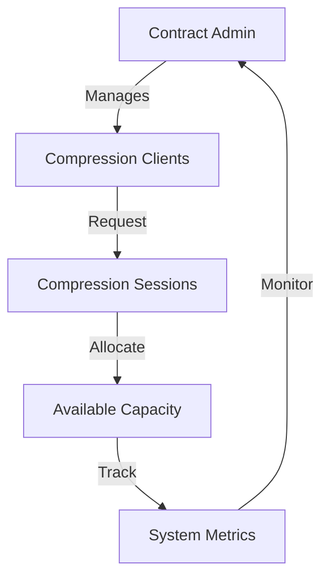

# Compress Client: Decentralized Compression Resource Management

A flexible, secure smart contract system for managing client-side compression resources on the Stacks blockchain. Compress Client enables dynamic allocation, tracking, and optimization of compression sessions across distributed networks.

## Overview

Compress Client introduces an on-chain mechanism for coordinating and tracking compression resources through a comprehensive smart contract system that:
- Registers clients with configurable compression capacities
- Dynamically allocates compression sessions
- Tracks resource utilization and system performance
- Maintains an immutable record of compression activities

### Key Features
- Client registration with capacity management
- Dynamic compression session allocation
- Resource utilization tracking
- Granular access control
- Comprehensive system metrics reporting

## Architecture

The system is built around a primary smart contract that manages the entire lifecycle of compression resources.



### Core Components
1. **Governance System**: Contract admin manages client registrations
2. **Client Registry**: Tracks client compression capabilities
3. **Session Management**: Handles compression resource allocation
4. **Metrics Tracking**: Records system-wide compression performance

## Contract Documentation

### Core Functionality

#### Access Control
- `contract-admin`: Manages client registrations
- `client-registry`: Tracks registered compression clients
- `compression-sessions`: Manages active compression allocations

#### Compression Resources
Each client and session contains:
- Maximum compression capacity
- Current resource allocation
- Session status and timing
- Cumulative compressed data

## Getting Started

### Prerequisites
- Clarinet
- Stacks wallet
- Test STX tokens (for testnet)

### Basic Usage

1. **Register a Compression Client**
```clarity
(contract-call? .compression-registry register-compression-client 
    tx-sender ; client principal
    u1000 ; max compression capacity
)
```

2. **Allocate Compression Session**
```clarity
(contract-call? .compression-registry allocate-compression-session
    tx-sender ; client principal
    u100 ; requested allocation
)
```

3. **Complete Compression Session**
```clarity
(contract-call? .compression-registry complete-compression-session
    u1 ; session-id
    u500 ; compressed data size
)
```

## Function Reference

### Administrative Functions
- `transfer-admin-rights(new-admin)`

### Client Management
- `register-compression-client(client, max-compression-capacity)`

### Compression Functions
- `allocate-compression-session(client, requested-allocation)`
- `complete-compression-session(session-id, compressed-data-size)`

### Query Functions
- `get-client-details(client)`
- `get-session-details(session-id)`
- `get-system-metrics()`

## Development

### Testing
Run the test suite using Clarinet:
```bash
clarinet test
```

### Local Development
1. Clone the repository
2. Install dependencies with `clarinet requirements`
3. Start local development chain with `clarinet start`

## Security Considerations

### Key Safeguards
- Strict admin-controlled client registration
- Capacity validation for compression sessions
- Granular session tracking
- Immutable resource allocation records

### Limitations
- Requires manual client registration
- Fixed compression capacity per client
- Statically managed compression resources